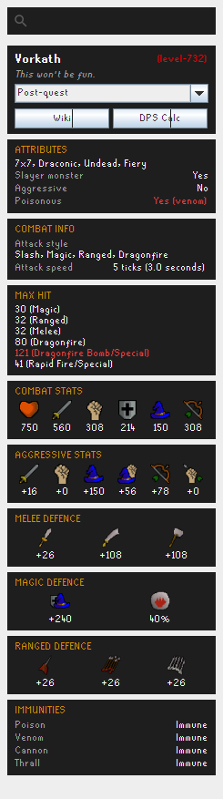
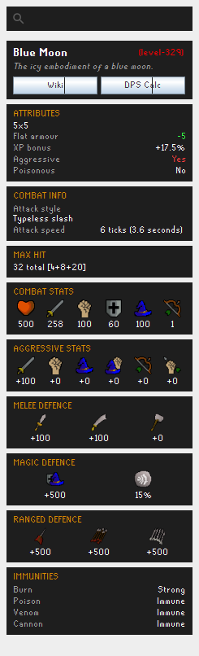
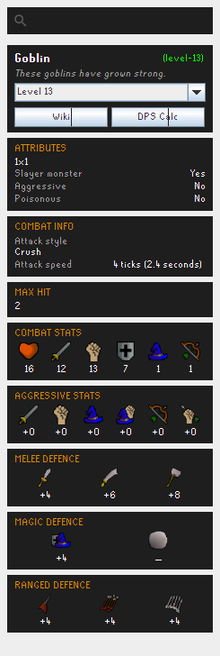

# Better Monster Examine

A RuneLite side-panel plugin to search any Old School RuneScape monster and view its
**full, wiki-style combat stats** — defences, offensive bonuses, weakness, immunities,
max hits and more — without leaving the client.

## Screenshots

| Boss showcase | Threat colour-coding | Combat-level colour |
|:--:|:--:|:--:|
|  |  |  |
| **Vorkath** — size and attributes on one line (*7x7, Draconic, Undead, Fiery*), and a **max hit above your Hitpoints level flagged red** (hover it for why). | **Blue Moon** — negative **flat armour in green** (−5: it takes extra damage), and **Aggressive: Yes in red**. | Combat level coloured against yours like the in-game hover (green = far below), with examine text. |

## Features

- **Searchable side panel** — type a monster name, or right-click any monster in game and
  pick **Stats** (matched by id *or* name, so it works across every spawn — e.g. Hellhounds
  in any dungeon). Variant forms (Vorkath's *Post-quest* vs *Dragon Slayer II*, or a
  monster's combat-level variants) are selectable from a dropdown.
- **Wiki-style infobox layout** — mirroring the OSRS Wiki:
  - **Header** — name with the combat level beside it, **coloured like the in-game hover**
    (green when far below your level, yellow at parity, red above), plus the examine text.
  - **Attributes** — size and attributes on one line (e.g. *7x7, Draconic, Undead, Fiery*),
    slayer-monster flag, flat armour (**green** when negative — it takes extra damage — and
    **red** when positive), XP bonus, **aggressive** (red when *Yes*), poisonous.
  - **Combat info** — attack style and attack speed (ticks + seconds).
  - **Max hit** — its own box; multi-hit monsters list each value, and **any value above
    your Hitpoints level is flagged red** (hover it for an explanation).
  - **Combat stats** (HP/Atk/Str/Def/Mag/Rng), **Aggressive stats**, and
    **Melee / Magic / Ranged defence** with elemental weakness, as icon-over-value rows.
  - **Immunities** — burn, poison, venom, cannon, thrall.
- **Quick links** — open the monster's **Wiki** page or the **DPS calculator**
  (deep-linked to the monster) in one click. The DPS link only sets the target
  monster. To pull in your current gear and stats, install the [WikiSync][ws] plugin
  and click the **RuneLite** button inside the calculator — it bridges your live
  loadout from the client (granting the browser's one-time access prompt).

[ws]: https://oldschool.runescape.wiki/w/RuneScape:WikiSync

## Data sources

- The bulk of the stats come from the [Weirdgloop OSRS DPS-calc dataset][wg]
  (`monsters.json`), keyed by NPC id. It's fetched on first use from the OSRS Wiki
  DPS-calc CDN — the same source the calculator itself uses — and cached under
  `.runelite/better-monster-examine/`, refreshing weekly, so later launches work offline.
- Fields the dataset doesn't carry (aggressive, poisonous, XP bonus, the full max-hit
  list, and poison/venom/cannon/thrall immunities) are fetched **on demand and cached**
  from the monster's OSRS Wiki infobox.

[wg]: https://github.com/weirdgloop/osrs-dps-calc

## Building / running

```
./gradlew run            # launch a dev client with the plugin loaded
./gradlew build          # build
```

## Credits & licence

This plugin began as a fork of [Koitere/monster-stats][orig] by **Liam King**, which is
released under the **BSD 2-Clause Licence**. That notice is retained in [`LICENSE`](LICENSE).
The data layer and UI have since been substantially rewritten.

[orig]: https://github.com/Koitere/monster-stats
