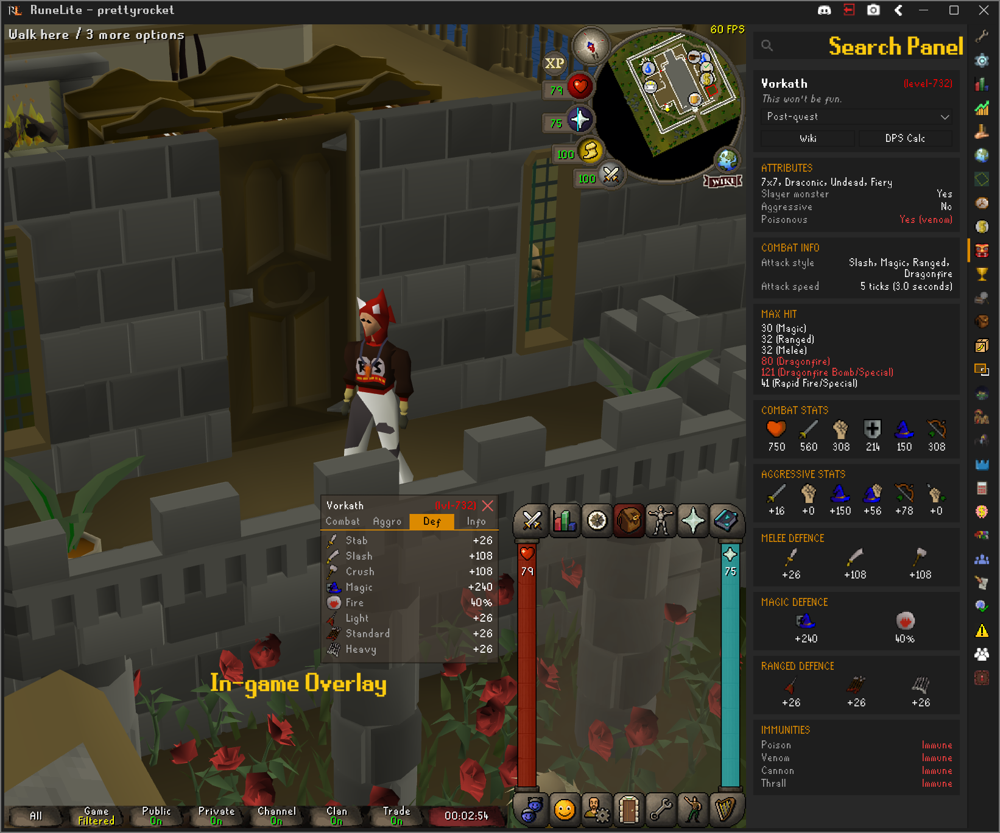
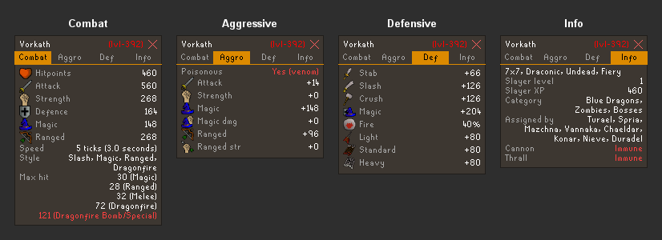
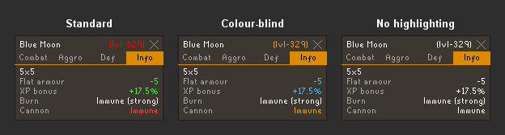

# Better Monster Examine

A RuneLite side-panel plugin to search any Old School RuneScape monster and view its
**full, wiki-style combat stats** — defences, offensive bonuses, weakness, immunities,
max hits and more — **and its complete drop tables**, without leaving the client.

## Screenshots

*Examining Vorkath — the full **Search Panel** on the right and the compact, tabbed
**in-game overlay** in the viewport.*

### Drops

*The **Drops** tab — the wiki's own drop-table sections, with rarity-coloured odds and
GE price / High Alch on hover.*

### In-game overlay

**Highlighting Modes**

## Features

- **Searchable side panel** — search for or right-click any monster in game and
  pick **Stats** or **Drops** (which entries appear is configurable). Variants are
  selectable from a dropdown.
- **Wiki-style infobox layout** — mirroring the OSRS Wiki with important values highlighted.
- **Drop tables** — a **Drops** tab shows the monster's full loot, grouped into the wiki's
  own sections (Herbs, Gem / Rare drop table, Catacombs of Kourend, Wilderness Slayer Cave,
  Tertiary, …) in page order. Each drop shows its quantity and odds — **colour-coded by
  rarity** — with **GE price & High Alch** on hover, and clicks through to the item's wiki page.
- **In-game overlay** — show the stats as a compact, tabbed card in the viewport instead of
  (or alongside) the side panel.
- **Recent & favorites** — the side panel's **↺** and **★** buttons hold your recently viewed
  monsters and a pinned favorites list, so you can re-open one without re-typing.
- **Quick links** — open the monster's **Wiki** page or the **DPS calculator**
  in one click.
- **Accessible highlighting** — colour coding is configurable: the default red/green palette, 
  a **colour-blind-friendly** palette with redundant cues, or off entirely.

## Credits & licence

This plugin began as a fork of [Koitere/monster-stats][orig]. 
The data layer and UI have since been substantially rewritten.

[orig]: https://github.com/Koitere/monster-stats
