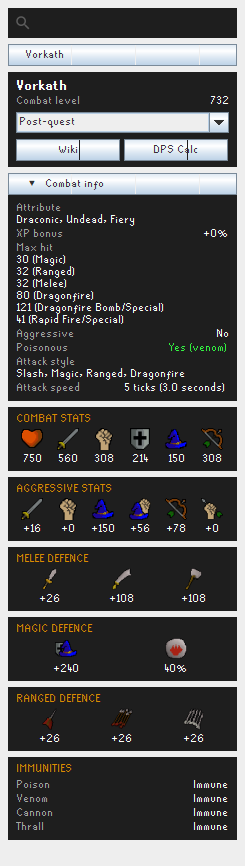

# Better Monster Examine

A RuneLite side-panel plugin to search any Old School RuneScape monster and view its
**full, wiki-style combat stats** — defences, offensive bonuses, weakness, immunities,
max hits and more — without leaving the client.



## Features

- **Searchable side panel** — type a monster name, or right-click a monster in game and
  pick **Stats**. Variant forms (e.g. Vorkath's *Post-quest* vs *Dragon Slayer II*) are
  selectable from a dropdown.
- **Wiki-style infobox layout** — each stat group is an icon-over-value row, mirroring the
  OSRS Wiki:
  - **Combat info** (collapsible): attributes, XP bonus, full multi-line max hit,
    aggressive, poisonous, attack style, attack speed (ticks + seconds).
  - **Combat stats** (HP/Atk/Str/Def/Mag/Rng), **Aggressive stats**, and
    **Melee / Magic / Ranged defence** with elemental weakness.
  - **Immunities** — burn, poison, venom, cannon, thrall.
- **Quick links** — open the monster's **Wiki** page or the **DPS calculator**
  (deep-linked to the monster) in one click.

## Data sources

- The bulk of the stats come from the [Weirdgloop OSRS DPS-calc dataset][wg]
  (`monsters.json`), keyed by NPC id.
- Fields the dataset doesn't carry (aggressive, poisonous, XP bonus, the full max-hit
  list, and poison/venom/cannon/thrall immunities) are fetched **on demand and cached**
  from the monster's OSRS Wiki infobox.

[wg]: https://github.com/weirdgloop/osrs-dps-calc

## Building / running

```
./gradlew runClient      # launch a dev client with the plugin loaded
./gradlew build          # build
```

## Credits & licence

This plugin began as a fork of [Koitere/monster-stats][orig] by **Liam King**, which is
released under the **BSD 2-Clause Licence**. That notice is retained in [`LICENSE`](LICENSE).
The data layer and UI have since been substantially rewritten.

[orig]: https://github.com/Koitere/monster-stats
